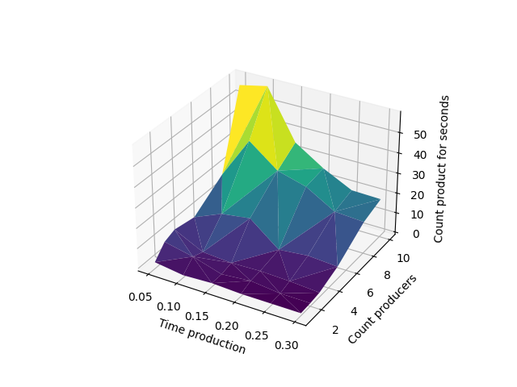
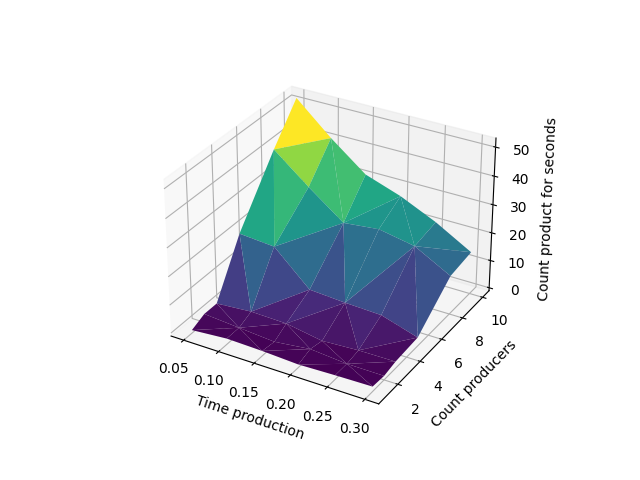
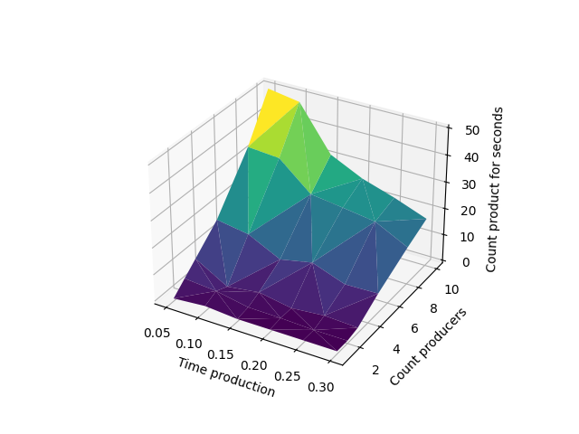
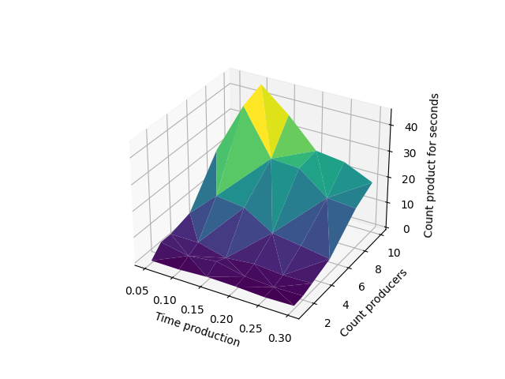
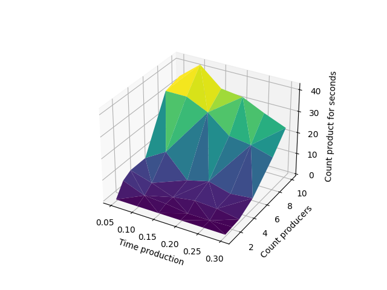

# Paralelné programovanie a distribuované systémy 2022
## Dokumentácia:
> Cvičenie 3

### Riešiteľ: 
> Bc. Lukáš Pribula

### Vyučujúci predmetu: 
> Mgr. Ing. Matúš Jókay, PhD.

### Zdroje: 
> Seminár PPDS 
> 
> [Stránka predmetu PPDS](https://uim.fei.stuba.sk/predmet/i-ppds/)
### Verzia Pythonu
> 3.10 a 3.9
### Obsah
Cieľom cvičenia 3 bolo implementovať riešenie problému Konzument-Producent 
a experimentálne zistiť, aké parametre sú optimálne pre náš systém
> **Program (main.py)**

> Pri experimentovaní sme sa zamerali na počet vyrobených výrobkov za jednotku času.
> Používali sme rôny počet konzumentov: [1, 2, 3, 5, 8, 10] a čas výroby [0.05, 0.1, 0.15, 0.2, 0.25, 0.3]

> **Veľkost skladu 10 a konzumentov 10**
> 

>  **Veľkost skladu 10 a konzumentov 20**
> 

>  **Veľkost skladu 10 a konzumentov 50**
> 

> **Veľkost skladu 50 a konzumentov 10**
> 

> **Veľkost skladu 20 a konzumentov 10**
> 

>Ako možeme vidieť ak máme málo konzumentov a dostatočné veľký sklad
> a výroba nieje zdlhavá tak sklad rýchlejšie naplníme. Ak však máme
> menší sklad a viac konzumentov tak malé množstvo producentov nestíha 
> doplňať dopyt. 