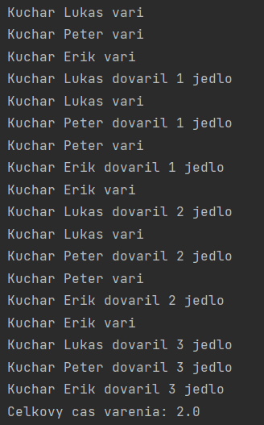

# Paralelné programovanie a distribuované systémy 2022
## Dokumentácia:
> Cvičenie 8

### Riešiteľ: 
> Bc. Lukáš Pribula

### Vyučujúci predmetu: 
> Mgr. Ing. Matúš Jókay, PhD.

### Zdroje: 
> Seminár PPDS 
>
> [Stránka predmetu PPDS](https://uim.fei.stuba.sk/predmet/i-ppds/)
### Verzia Pythonu
> 3.10 a 3.9

Cieľom cvičenia 8 bolo napísať jednovláknovú aplikáciu v dvoch verziách: synchrónnej a asynchrónnej (pomocou natívnych korutín)

>Zvolili sme si simuláciu varenia 3 kuchárov

> ### Synchronný program
> Prvý program(main.py) obsahuje synchrónnu verziu.
> 
> Funkcia cooking() je generátor. Tá nám umožňuje prerušiť vykonávanie úlohy zavolaním príkazu yield.
> Nakoľko kuchári varia 3 jedla, a po každom navarenom jedle sa striedajú(predstava že maju iba 1 sporak), potrebujeme aby sa program vratil na správnu
> "poziciu" čo nám pomôže príkaz next()

> ### Asynchroný program
> Druhý program(main.py) obsahuje asynchrónnu verziu.
> 
> Pre asynchrónny beh programu sme využili kľúčove slová async a await z balíka asyncio
> Funkcie sú označené príkazom async. Znamená to, že sa jedná o natívnu korutinu. Beh takéhoto programu 
> je možné prerušiť pri riadkoch označených príkazom await.
>Pomocou príkazu asyncio.gather() spustíme naše objekty(kuchárov).
> Týmto spôsobom zabezpečime že kuchári na seba nemusia čakať(predstava že maju viacero sporakov)

> ### Porovnanie
>#### Synchronna verzia
> 
>#### Asynchronna verzia
> 
> 
> Ako môžeme vidieť pri synchronnom behu(kuchári varili iba s 1 sporákom) nám varenie trvalo 6 "hodin", 
> zatiaľ čo pri asynchronnom behu(viacej sporakov) nám to trvalo iba 2 "hodiny".
> Nakoľko asynchronny beh nieje blokujúci pre ostatných
>

